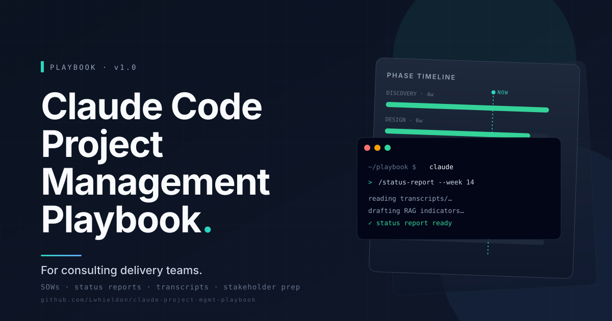
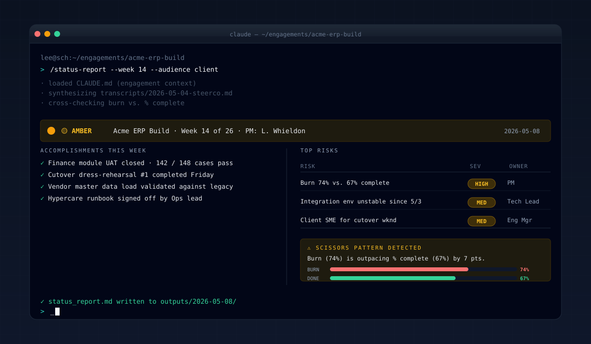
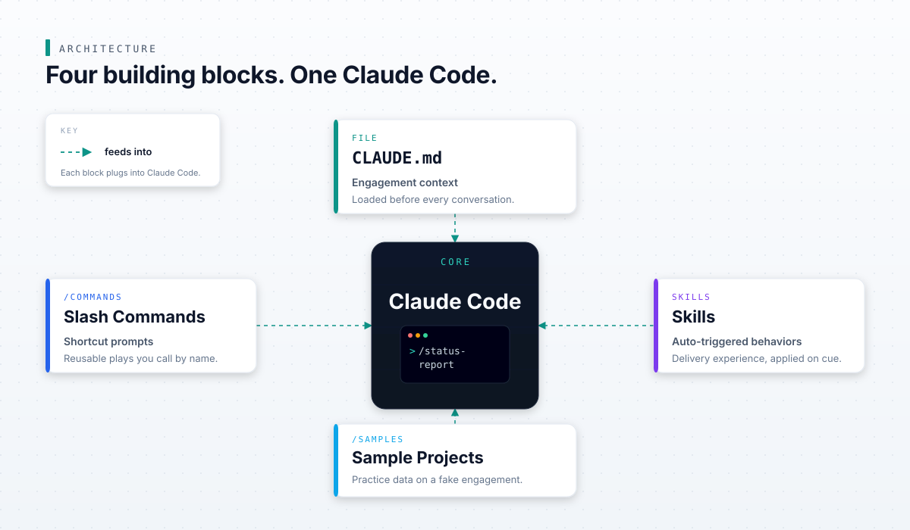
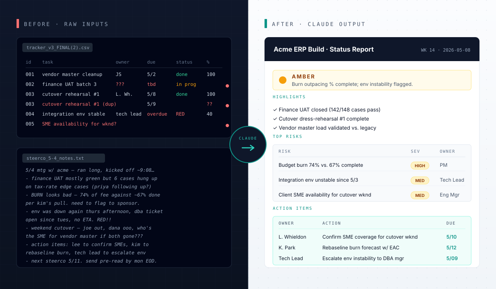

# Claude Code Project Management Playbook



## 🎯 What this is

A templatized baseline for consulting delivery teams who want to use Claude and Claude Code to accelerate engagement work: reviewing Statements of Work, drafting status reports, analyzing meeting transcripts, prepping for stakeholder meetings, and more. Clone this repo, open it in Claude Code, and you have a team-ready starting point tuned for project leadership. No engineering background required.



## 🚀 Quickstart

**Requirements:** Node.js 18+, a paid Anthropic plan (Pro, Team, or API key with credits), Git and a terminal.

```bash
git clone https://github.com/YOUR_ORG/claude-project-mgmt-playbook.git
cd claude-project-mgmt-playbook
claude
```

Claude Code reads `CLAUDE.md` automatically on startup. Try your first command:

```
/sow-review sample-projects/acme-data-warehouse/sow.md
```

## 📁 What's in here

```
claude-project-mgmt-playbook/
├── README.md                          This file
├── CLAUDE.md                          Persistent project context (edit for your engagement)
├── docs/
│   ├── getting-started.md             Step-by-step setup and first session guide
│   └── glossary.md                    Key terms: CLAUDE.md, slash commands, skills, subagents
├── .claude/
│   └── commands/                      Slash commands (type /name inside Claude Code)
│       ├── status-report.md           Generate a weekly status report from project data
│       ├── transcript-actions.md      Extract action items and decisions from a transcript
│       ├── sow-review.md              Review a Statement of Work for risks and gaps
│       ├── stakeholder-prep.md        Prep for a stakeholder meeting and draft a follow-up
│       ├── change-request.md          Draft a formal change request document
│       ├── code-review-light.md       Non-engineer-friendly review of code or data artifacts
│       └── exec-summary.md            Compress a long document into a 1-page executive summary
├── skills/                            Skills (Claude invokes these on relevant tasks)
│   ├── deliverable-qa/SKILL.md        QA a client deliverable against consulting quality standards
│   ├── meeting-prep/SKILL.md          Prepare for a client or internal meeting
│   └── status-comms/SKILL.md          Draft multi-format status communications
└── sample-projects/                   Fictional practice projects, safe to share and experiment with
    ├── acme-data-warehouse/           Retail data warehouse modernization (Snowflake migration)
    └── globex-erp-migration/          Manufacturing ERP implementation (SAP S/4HANA)
```

## 💡 The four building blocks

This playbook gives you four practical layers you can use immediately and build on as your engagement evolves. `CLAUDE.md` is your persistent briefing document: it holds your client context, communication standards, and project notes so Claude starts every session already oriented to your engagement. Slash commands are one-word shortcuts for the PM tasks you do every week, from reviewing a SOW to pulling action items from a transcript. Skills are reusable behaviors Claude triggers automatically when you describe a relevant task, so you get consistent output without having to remember the right command. Sample projects give you realistic, fictional data to practice on before your first real client session.



- **CLAUDE.md**: Persistent context that tells Claude who the client is, what the engagement standards are, and what has happened so far
- **Slash commands**: Shortcut prompts for recurring tasks: status reports, SOW reviews, transcript cleanup, stakeholder prep
- **Skills**: Auto-triggered behaviors for deliverable QA, meeting prep, and status communications
- **Sample projects**: Two fictional engagements with real artifacts (SOWs, transcripts, CSVs) to practice on safely

## 🛠️ Slash commands

Type `/command-name` inside Claude Code. Commands live in `.claude/commands/` as Markdown files; edit them or add your own.

| Command | What it does | Use when |
|---|---|---|
| `/status-report` | Generates a structured weekly status report from a CSV or free-text summary | You need a client-ready update from raw project data |
| `/transcript-actions` | Extracts action items, decisions, and risks from a meeting transcript | Coming off a call with messy notes |
| `/sow-review` | Reviews a Statement of Work for scope risks and negotiation points | Before signing, or when a client sends a new SOW |
| `/stakeholder-prep` | Prepares agenda, talking points, and a follow-up email template | 30-60 minutes before a client or executive meeting |
| `/change-request` | Drafts a formal change request document | A scope change needs to be documented and approved |
| `/exec-summary` | Compresses a long document into a 1-page executive summary | A decision-maker will not read the full document |
| `/code-review-light` | Plain-English review of a code or data artifact | A delivery lead needs to understand what changed without an engineering background |

## 🧠 Skills

Skills are invoked automatically when you describe a matching task, or manually by typing `/skill-name`. They live in `skills/`.

| Skill | What it does | Use when |
|---|---|---|
| `deliverable-qa` | Reviews a client deliverable against consulting quality standards and flags issues | Before sending any report, deck, or document to the client |
| `meeting-prep` | Generates agenda, talking points, anticipated questions, and a follow-up email template | Preparing for any client or internal meeting |
| `status-comms` | Drafts multi-format status communications: email, slide bullets, or dashboard narrative | You need the same status story formatted for different audiences |

## 🧪 Try it on the sample projects

Two fictional engagement scenarios are included so you can see the playbook in action before using it on a real project.

**Acme Data Warehouse** (`sample-projects/acme-data-warehouse/`): A retail data warehouse migration to Snowflake, mid-build with a visible schedule trend and a go-live date under pressure. Start here:

```
/status-report sample-projects/acme-data-warehouse/status-data.csv
```

**Globex ERP Migration** (`sample-projects/globex-erp-migration/`): A manufacturing SAP S/4HANA implementation with a contested scope change already in play. Start here:

```
/sow-review sample-projects/globex-erp-migration/sow.md
```



When you are ready to use the playbook on a real engagement, edit `CLAUDE.md` with your client details and add your actual project files (SOW, transcripts, status data) to a new folder alongside the sample projects.

## 🔒 Working with client data

If you use this playbook on a real engagement, these rules are non-negotiable.

- **Never paste raw client data into a prompt.** Reference files by path so Claude reads them directly. Do not copy-paste client data into the chat.
- **Use `CLAUDE.local.md` for sensitive context.** This file is gitignored. Put session-specific notes, client names, and anything you would not commit to a shared repo here, not in `CLAUDE.md`.
- **Treat all PII, financial figures, and proprietary process details as confidential.** Anonymize or sanitize before referencing in any prompt.
- **When in doubt, describe rather than share.** "The pipeline processes approximately 3TB of order history data" is safer than pasting the schema.

## 📚 Learn more

**In this repo:**

- [`docs/getting-started.md`](docs/getting-started.md): Step-by-step setup and your first session walkthrough
- [`docs/glossary.md`](docs/glossary.md): Key terms explained (CLAUDE.md, slash commands, skills, subagents, context window)

**External:**

- [Claude Code documentation](https://docs.anthropic.com/en/docs/claude-code): Official Anthropic docs covering installation, configuration, slash commands, and skills
- [Claude Code on claude.ai](https://claude.ai/code): Download, pricing, and plan options

## 🤝 Contributing

If you develop a slash command or skill that saves time on a project, consider contributing it back. Open a PR with the new file and a one-line description of when to use it.

## 📄 License

MIT. See [LICENSE](LICENSE).
